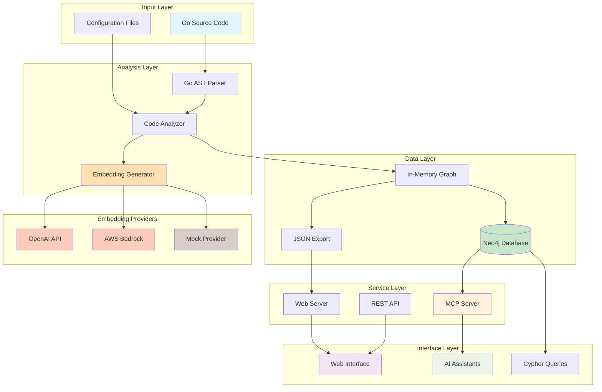
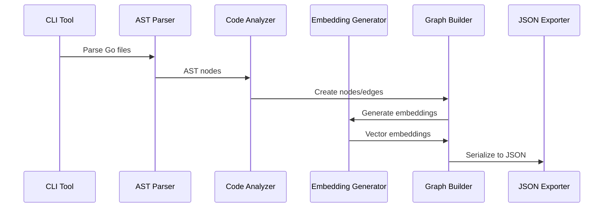
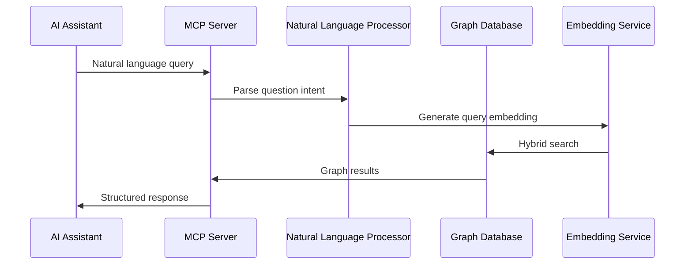
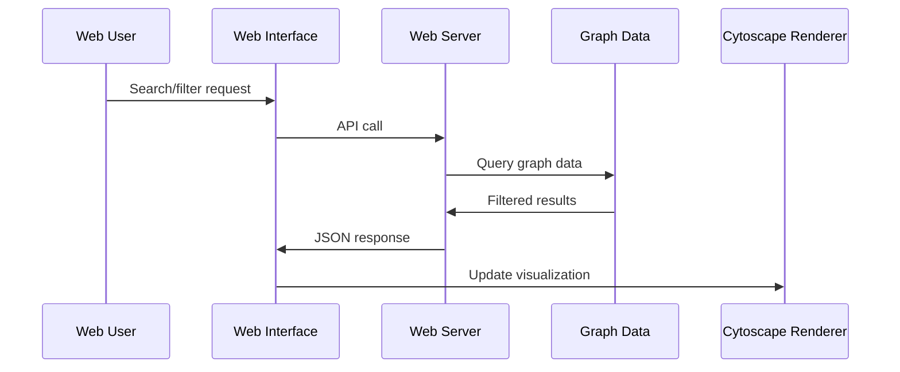
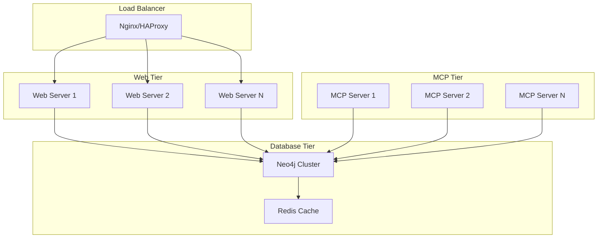

# Technical Architecture

## Overview

Go Code Graph is a comprehensive Go codebase analysis system that combines static code analysis, graph database storage, semantic embeddings, and AI-powered querying through the Model Context Protocol (MCP).

## System Architecture



## Core Components

### 1. Code Analysis Engine (`internal/analyzer/`)

The heart of the system that parses Go source code and builds graph representations.

#### Parser (`parser.go`)

- **AST Processing**: Uses Go's `go/ast` and `go/types` packages
- **Graph Building**: Creates nodes and edges representing code structure
- **Relationship Detection**: Identifies calls, imports, embeds, implementations
- **Complexity Calculation**: Computes cyclomatic complexity scores

#### Types (`types.go`)

- **Graph Data Structures**: Defines nodes, edges, and metadata
- **Enhanced Schema**: Supports 9 node types and 12 relationship types
- **Serialization**: JSON marshaling for persistence and export

```go
type Graph struct {
    Nodes    []EnhancedNode `json:"nodes"`
    Edges    []EnhancedEdge `json:"edges"`
    Metadata GraphMetadata  `json:"metadata"`
    Stats    GraphStats     `json:"stats"`
}

type EnhancedNode struct {
    ID                string     `json:"id"`
    Label             string     `json:"label"`
    Type              string     `json:"type"`
    Package           string     `json:"package"`
    FullName          string     `json:"full_name"`
    Signature         string     `json:"signature,omitempty"`
    Complexity        int        `json:"complexity,omitempty"`
    Position          Position   `json:"position,omitempty"`
    Visibility        string     `json:"visibility"`
    SemanticSummary   string     `json:"semantic_summary,omitempty"`
    Embedding         []float32  `json:"embedding,omitempty"`
    EmbeddingModel    string     `json:"embedding_model,omitempty"`
}
```

### 2. Embedding System (`internal/embeddings/`)

Provider-agnostic semantic embedding generation for enhanced code understanding. The embedding system supports multiple providers through a clean interface design.

#### Interface Definition

```go
type Client interface {
    CreateEmbedding(text string) ([]float32, error)
    BatchCreateEmbeddings(texts []string) ([][]float32, error)
    GetModelName() string
    GetDimensions() int
}
```

#### Supported Providers

| Provider | Model | Dimensions | Features |
|----------|-------|------------|----------|
| **AWS Bedrock** | `amazon.titan-embed-text-v2:0` | 1024 | Batch processing, AWS native |
| **OpenAI** | `text-embedding-ada-002` | 1536 | High quality, general purpose |
| **OpenAI** | `text-embedding-3-small` | 1536 | Faster, cost-effective |
| **OpenAI** | `text-embedding-3-large` | 3072 | Maximum quality |
| **Mock** | `mock-model` | 384+ | Testing, deterministic |

#### Factory Pattern

```go
func NewClient(ctx context.Context, config Config) (Client, error) {
    switch config.Provider {
    case "openai":
        return NewOpenAIClient(ctx, config)
    case "bedrock":
        return NewBedrockClient(ctx, config)
    case "mock":
        return NewMockClient(config)
    default:
        return nil, fmt.Errorf("unsupported provider: %s", config.Provider)
    }
}
```

#### Configuration

```go
type Config struct {
    Provider string                 // "bedrock", "openai", "mock"
    Model    string                 // Optional, defaults per provider
    Options  map[string]interface{} // Provider-specific options
}
```

#### Semantic Summary Generation

The embedding system generates semantic summaries for code nodes using graph relationships:

```go
// Graph-aware semantic summary generation
func (e *EmbeddingsGenerator) createSemanticSummary(node *Node) string {
    rels := e.getNodeRelationships(node.ID)
    
    // Build context from actual graph edges
    // - Function calls
    // - Type usage
    // - Interface implementations
    // - Error handling patterns
    // - Concurrency patterns
}
```

### 3. Neo4j Integration (`internal/neo4j/`)

High-performance graph database storage with advanced query capabilities.

#### Neo4j Features

- **Batch Import**: Efficient bulk data loading
- **Vector Indexing**: Supports semantic search with embeddings
- **Constraint Management**: Ensures data integrity
- **Performance Optimization**: Parameterized queries, connection pooling

#### Graph Schema

```cypher
// Node Types
(:Package {name, path, id})
(:Struct {name, package, id, complexity, embedding})
(:Interface {name, package, id})
(:Function {name, package, id, complexity, signature, embedding})
(:Method {name, package, id, complexity, signature, embedding})
(:Field {name, package, id, type_name})
(:Parameter {name, package, id, type_name, index})

// Relationship Types
()-[:IMPORTS]->()         // Package dependencies
()-[:CALLS]->()          // Function/method calls
()-[:EMBEDS]->()         // Struct embedding
()-[:HAS_FIELD]->()      // Struct fields
()-[:HAS_METHOD]->()     // Type methods
()-[:IMPLEMENTS]->()     // Interface implementation
()-[:CONSTRUCTS]->()     // Type instantiation
()-[:RETURNS]->()        // Return types
```

### 4. MCP Server (`internal/mcpserver/`)

Model Context Protocol server providing AI assistants with deep codebase understanding.

#### Core Tools

- **natural_query**: Natural language to Cypher conversion
- **cypher_query**: Direct graph database access
- **analyze_impact**: Change impact analysis
- **find_patterns**: Code pattern detection
- **find_implementers**: Interface implementation discovery
- **trace_call_path**: Call chain analysis
- **detect_architecture**: Architectural pattern detection

#### Query Organization

```text
internal/mcpserver/queries/
├── duplicate_functions.cypher
├── usage_functions.cypher
├── find_implementers.cypher
└── trace_call_path.cypher
```

#### Hybrid Search Algorithm

```go
// Combines vector similarity with graph traversal
hybridQuery := `
    // 1. Vector similarity search
    CALL db.index.vector.queryNodes('code_embeddings_index', 10, $queryEmbedding) 
    YIELD node as similarNode, score
    
    // 2. Graph traversal expansion
    OPTIONAL MATCH (similarNode)-[r:RELATES_TO]-(relatedNode:CodeNode)
    
    // 3. Relevance scoring
    WITH similarNode, score, collect(relatedNode) as related
    RETURN similarNode, score, related
    ORDER BY score DESC, size(related) DESC
`
```

### 5. Web Interface (`internal/server/`)

Modern, responsive web interface for interactive code exploration.

#### Features

- **Real-time Search**: Fuzzy search with autocomplete
- **Advanced Filtering**: By type, complexity, visibility
- **Interactive Visualization**: Cytoscape.js-powered graphs
- **Performance Optimization**: Handles 4,000+ nodes
- **Responsive Design**: Desktop and mobile support

#### Technology Stack

- **Backend**: Go HTTP server with JSON API
- **Frontend**: Vanilla JavaScript with Cytoscape.js
- **Styling**: Modern CSS with CSS Grid/Flexbox
- **Charts**: Chart.js for analytics
- **Performance**: WebGL rendering for large graphs

## Data Flow Architecture

### 1. Analysis Pipeline



### 2. MCP Query Pipeline



### 3. Web Interface Pipeline



## Performance Architecture

### 1. Analysis Performance

- **Parallel Processing**: Goroutines for concurrent package analysis
- **Memory Management**: Streaming processing for large codebases
- **Caching**: AST caching to avoid re-parsing
- **Incremental Updates**: Support for delta analysis
- **Batch Embeddings**: Process multiple texts in single API calls

#### Embedding Performance Optimization

```go
// Batch processing for large codebases
texts := extractSemanticSummaries(nodes)
embeddings, err := client.BatchCreateEmbeddings(texts)

// Performance comparison (1000 nodes)
// Individual: 1,000 API calls, ~10 minutes
// Batch (50): 20 API calls, ~2 minutes (80% faster)
// Batch (100): 10 API calls, ~1.5 minutes (85% faster)
```

### 2. Database Performance

- **Batch Operations**: Bulk imports and updates
- **Index Strategy**: Optimized for common query patterns
- **Connection Pooling**: Efficient resource utilization
- **Query Optimization**: Parameterized queries with EXPLAIN analysis

### 3. Web Performance

- **Lazy Loading**: Progressive graph rendering
- **Viewport Culling**: Only render visible elements
- **Data Pagination**: Chunked data loading for large graphs
- **Caching Strategy**: Browser and server-side caching

## Scalability Architecture

### Horizontal Scaling



### Vertical Scaling Considerations

- **Memory Requirements**: 1GB+ for enterprise codebases
- **CPU Usage**: Multi-core beneficial for analysis
- **Storage**: SSD recommended for Neo4j
- **Network**: High bandwidth for large graph transfers

## Security Architecture

### 1. Data Security

- **Encryption at Rest**: Neo4j enterprise encryption
- **Transport Security**: TLS for all network communication
- **Access Control**: Role-based permissions in Neo4j
- **API Security**: Rate limiting and authentication

### 2. Code Security

- **Input Validation**: Sanitized user inputs and queries
- **Injection Prevention**: Parameterized Cypher queries
- **Resource Limits**: Memory and CPU limits for analysis
- **Audit Logging**: Comprehensive operation logging

## Deployment Architecture

### Development Environment

```yaml
# docker-compose.dev.yml
services:
  neo4j:
    image: neo4j:5.15-enterprise
    environment:
      NEO4J_ACCEPT_LICENSE_AGREEMENT: "yes"
      NEO4J_AUTH: neo4j/password
    ports:
      - "7474:7474"
      - "7687:7687"
    volumes:
      - neo4j_data:/data
      - neo4j_logs:/logs
```

### Production Environment

```yaml
# docker-compose.prod.yml
services:
  web:
    build: .
    command: ./bin/server -graph=/data/graph.json
    ports:
      - "8080:8080"
    volumes:
      - ./data:/data
    depends_on:
      - neo4j
      
  mcp:
    build: .
    command: ./bin/mcp-server
    environment:
      NEO4J_URI: bolt://neo4j:7687
      NEO4J_USER: neo4j
      NEO4J_PASSWORD: ${NEO4J_PASSWORD}
    depends_on:
      - neo4j
      
  neo4j:
    image: neo4j:5.15-enterprise
    environment:
      NEO4J_ACCEPT_LICENSE_AGREEMENT: "yes"
      NEO4J_AUTH: neo4j/${NEO4J_PASSWORD}
    volumes:
      - neo4j_data:/data
      - neo4j_logs:/logs
    ports:
      - "7474:7474"
      - "7687:7687"
```

## Configuration Management

### Environment Variables

```bash
# Core Configuration
GRAPH_FILE=/data/graph.json
WEB_PORT=8080
WEB_HOST=0.0.0.0

# Neo4j Configuration
NEO4J_URI=bolt://localhost:7687
NEO4J_USER=neo4j
NEO4J_PASSWORD=password

# Embedding Configuration
EMBEDDING_PROVIDER=bedrock  # "bedrock", "openai", or "mock"
EMBEDDING_MODEL=amazon.titan-embed-text-v2:0  # Optional, defaults per provider

# Provider-specific settings
# AWS Bedrock
AWS_REGION=us-east-1
AWS_PROFILE=default

# OpenAI
OPENAI_API_KEY=sk-your-key-here

# MCP Configuration
MCP_VERBOSE=true
MCP_LOG_LEVEL=info
```

### Programmatic Configuration

```go
// Bedrock configuration
bedrockConfig := embeddings.Config{
    Provider: "bedrock",
    Model:    "amazon.titan-embed-text-v2:0",
    Options: map[string]interface{}{
        "region": "us-east-1",
    },
}

// OpenAI configuration
openaiConfig := embeddings.Config{
    Provider: "openai", 
    Model:    "text-embedding-ada-002",
    Options: map[string]interface{}{
        "apiKey": "sk-your-key-here",
    },
}
```

### Feature Flags

```go
type Config struct {
    EnableEmbeddings    bool `json:"enable_embeddings"`
    EnableComplexity    bool `json:"enable_complexity"`
    EnableWebUI         bool `json:"enable_web_ui"`
    EnableMCPServer     bool `json:"enable_mcp_server"`
    MaxNodes           int  `json:"max_nodes"`
    MaxComplexity      int  `json:"max_complexity"`
}
```

## Extension Points

### 1. Custom Node Types

```go
type CustomNode struct {
    EnhancedNode
    CustomField string `json:"custom_field"`
}
```

### 2. Custom Analysis Rules

```go
type AnalysisRule interface {
    Apply(node *EnhancedNode, graph *Graph) error
    Name() string
    Priority() int
}
```

### 3. Custom Export Formats

```go
type Exporter interface {
    Export(graph *Graph, writer io.Writer) error
    Format() string
    MimeType() string
}
```

### 4. Adding New Embedding Providers

To add a new embedding provider:

1. **Implement the interface**:

```go
type NewProviderClient struct {
    model string
    // provider-specific fields
}

func (n *NewProviderClient) CreateEmbedding(text string) ([]float32, error) {
    // Implementation
}

func (n *NewProviderClient) BatchCreateEmbeddings(texts []string) ([][]float32, error) {
    // Batch implementation
}

func (n *NewProviderClient) GetModelName() string { return n.model }
func (n *NewProviderClient) GetDimensions() int { return 768 }
```

1. **Add to factory**:

```go
case "newprovider":
    return NewNewProviderClient(ctx, config)
```

## Monitoring and Observability

### Metrics

- **Analysis Metrics**: Processing time, node/edge counts, memory usage
- **Database Metrics**: Query performance, connection pool usage
- **Web Metrics**: Request latency, concurrent users, cache hit rates
- **MCP Metrics**: Tool usage, query complexity, embedding requests

### Logging

```go
// Structured logging with context
logger := slog.New(slog.NewJSONHandler(os.Stdout, nil))
logger.Info("Analysis started", 
    "repo", repoPath,
    "packages", packageCount,
    "start_time", time.Now())
```

### Health Checks

```go
// Health check endpoints
func (s *Server) healthCheck(w http.ResponseWriter, r *http.Request) {
    health := map[string]interface{}{
        "status": "healthy",
        "neo4j": s.neo4jClient.Ping(),
        "embedding": s.embeddingClient.Health(),
        "uptime": time.Since(s.startTime),
    }
    json.NewEncoder(w).Encode(health)
}
```

## Future Architecture Considerations

### 1. Microservices Migration

- **Analysis Service**: Dedicated code analysis microservice
- **Embedding Service**: Centralized embedding generation
- **Query Service**: Specialized graph query processing
- **Web Service**: Frontend and API gateway

### 2. Event-Driven Architecture

- **Change Detection**: File system watchers for incremental updates
- **Event Streaming**: Kafka/NATS for real-time updates
- **CQRS Pattern**: Separate read/write models

### 3. Cloud-Native Deployment

- **Kubernetes**: Container orchestration
- **Helm Charts**: Configuration management
- **Service Mesh**: Istio for communication security
- **Observability**: Prometheus, Grafana, Jaeger

### 4. Embedding Enhancements

- **Adaptive Batching**: Automatically adjust batch size based on provider performance
- **Caching Layer**: Add embedding caching to reduce API calls
- **Auto-retry Logic**: Handle transient failures with exponential backoff
- **Metrics & Monitoring**: Track usage, latency, and costs per provider
- **Streaming Processing**: Support streaming for very large codebases

## Benefits of the Architecture

### 1. **Flexibility**

- Switch embedding providers without code changes
- Use different providers for dev/staging/prod
- Easy A/B testing of embedding quality

### 2. **Cost Optimization**

- Use cheaper providers for development
- Premium providers for production workloads
- Mock provider for CI/CD testing

### 3. **Vendor Independence**

- No vendor lock-in
- Easy migration between providers
- Future-proof architecture

### 4. **Testing & Development**

- Deterministic mock embeddings for tests
- No API calls needed for development
- Consistent test results

This architecture provides a solid foundation for scalable, maintainable code analysis with modern AI integration capabilities and flexible embedding support.
